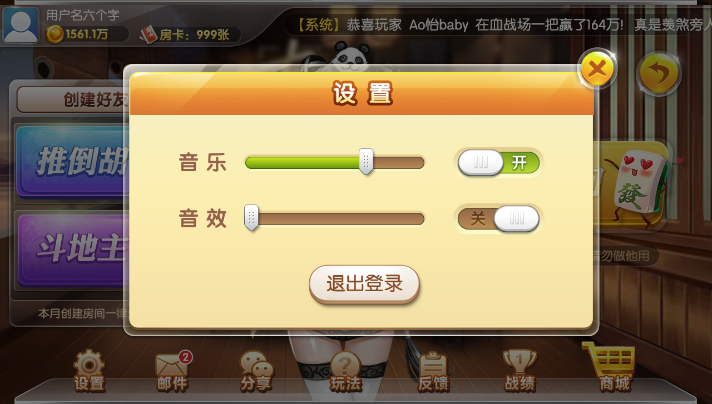

# 项目环境
- 本项目采用maven多模块构建。
- JDK1.8
- netty4.1.14-final

# 启动方式
- 替换[config.properties](server/src/main/resources/config.properties)文件的configDataPath
- 替换[game.properties](server/src/main/resources/game.properties)文件的数据库配置
- 右键 运行[GameServerBootstrap](server/src/main/java/info/xiaomo/server/GameServerBootstrap.java)

# 鸣谢
[贝密游戏](http://git.oschina.net/beimigame/beimi): 使用贝密游戏的开源UI

# 项目预览

      